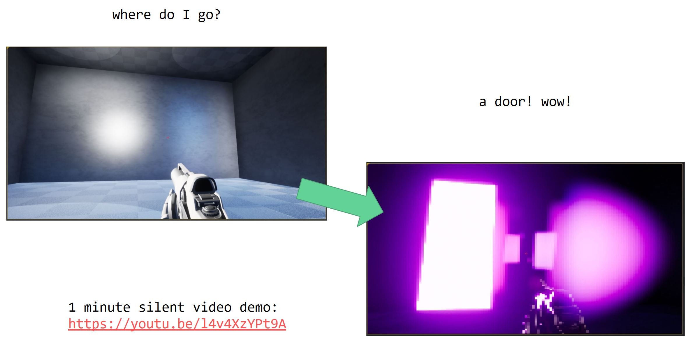
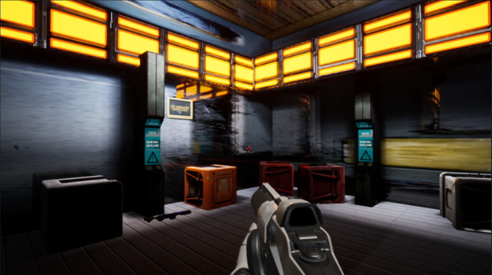
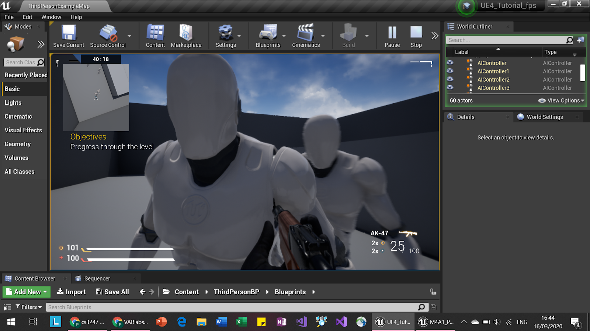

# glitch
this is our cs3247 (game development) project!

"our game is set in the far future, where only robots and sentient AIs exist. 
you have become a glitched out AI program and have escaped the wrath of the evil master AI, NULL, that seeks to control the rest of the world. 
it has stripped the world of graphics in its quest for efficient world dominance. so, it is up to you, the only bot that can defy NULL, to bring colour back into the world and save it from NULL...
or will you ¿¿"

## level design
- levels will consist of puzzles and enemies that require you to switch the **advanced vision** (name pending) on and off to your best advantage.
- examples: can see certain doors and enemies with **advanced vision** on
- but relying on it too much can make you see things that aren’t actually there (as it is a buggy new technology)

***advanced vision** concept. Youtube link: https://youtu.be/l4v4XzYPt9A*

## visual design
- high-tech, futuristic, "inside the system" theme
- **advanced vision** changes the screen in several ways:
  - tints the screen a certain color (currently purple)
  - pixellizes the screen to show that it's "part of the system"
- player, enemies and other creatures will be robots

*props concept*

## player design
in this game you can:
- move around
- shoot (and bounce objects around)
- turn “InTeGrAtEd GrApHiCs” on / off
- pick up upgrades
- interact with a few level objects

*HUD concept, placeholder enemies and weapons*

## ASSETS USED:
### Sound:
* Health damage sound: https://freesound.org/people/InspectorJ/sounds/458584/
* Shield damage sound: https://freesound.org/people/unfa/sounds/193429/
* Button sound effects obtained from https://www.zapsplat.com
### Music

* "Steamtech Mayhem"
* "Dark Techno City"
* "Factory on Mercury"
by Eric Matyas

https://soundimage.org/